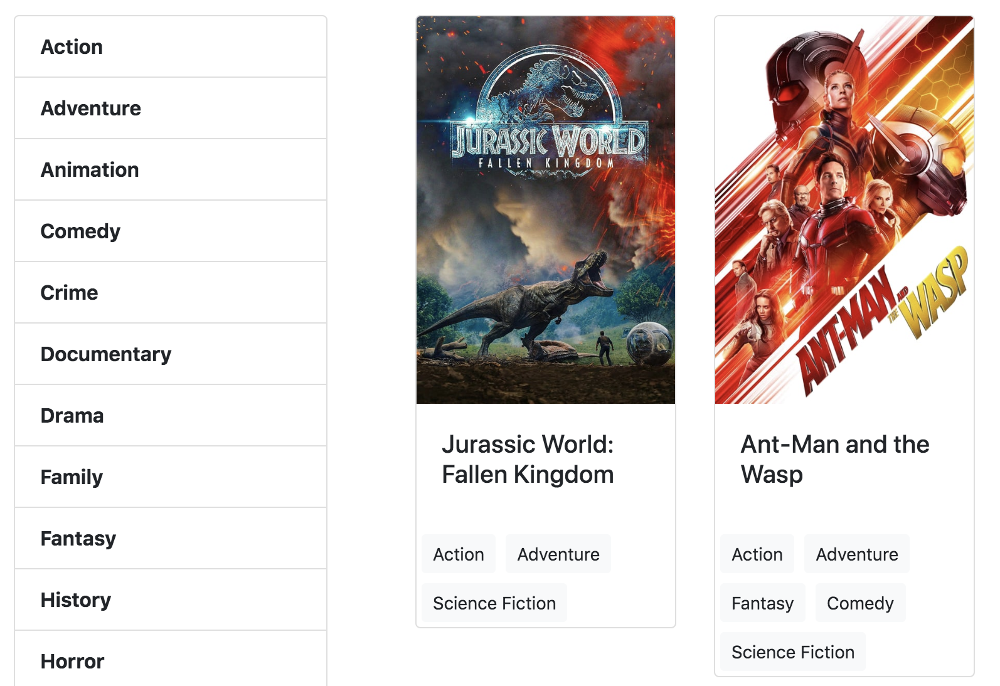

# Movie List
***

### About

This movie list is a personal project for Alpha Camp's Semester 2. 

The movie list connects to a specialized movie database API^[first] provided by Alpha Camp. It sorts fetched data by movie genre. Under each movie, you also find tags that specify genres that it belongs to.
 
[^first]: The movie database API is only for educational purpose, with no intention of copyright infringement.

Demo:
[https://codepen.io/Zong-Rong/full/vYEmVVy](https://codepen.io/Zong-Rong/full/vYEmVVy)

***
### Updates

+ First launch (*2019 December 29*)

***

### How to use

1. Ensure that your computer is well connected to the Internet.
2. Open the contained .html file.
3. Click on a desired movie genre on the left. Movies under the genre are then displayed.

